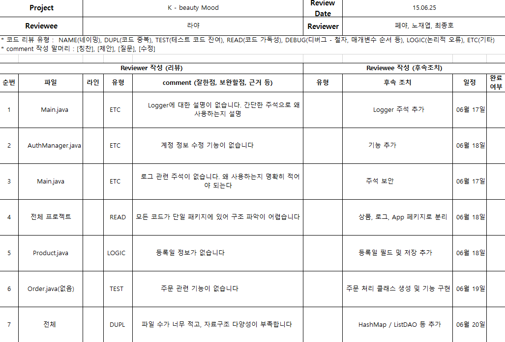

# 🎀 K-Beauty Mood 🎀

## 프로젝트 소개
K-Beauty Mood는 사용자의 현재 감정을 기반으로 한국 화장품을 추천해주는 콘솔 Java 애플리케이션입니다.  
사용자는 감정을 선택하고, 시스템은 적합한 상품을 추천하며 장바구니에 추가 후 가상 결제까지 진행할 수 있습니다.

---

## 주요 기능
- 사용자 인증 (예: 아이디: sofa / 비밀번호: 1234)
- 12가지 감정 유형별 화장품 추천 (기쁨, 로맨틱, 불안, 설렘, 스트레스, 슬픔, 에너지, 영감, 외로움, 자신감, 피로, 혼란)
- 선택한 상품 장바구니에 담기
- 장바구니 조회
- 카드 번호와 비밀번호 입력을 통한 결제 처리
- 상세 영수증 및 사용자 행동 로그 출력

---

## 기술 스택
- Java (Eclipse IDE)
- 콘솔 기반 애플리케이션

---

## 코드 리뷰 
 
